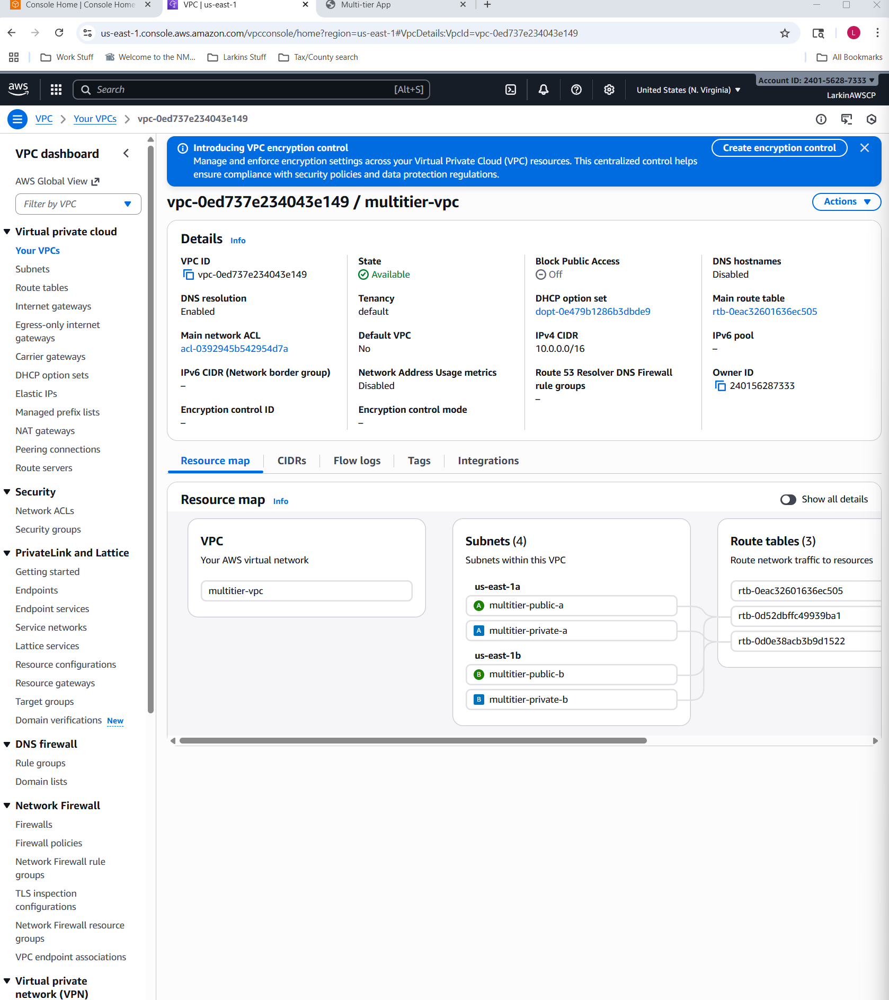
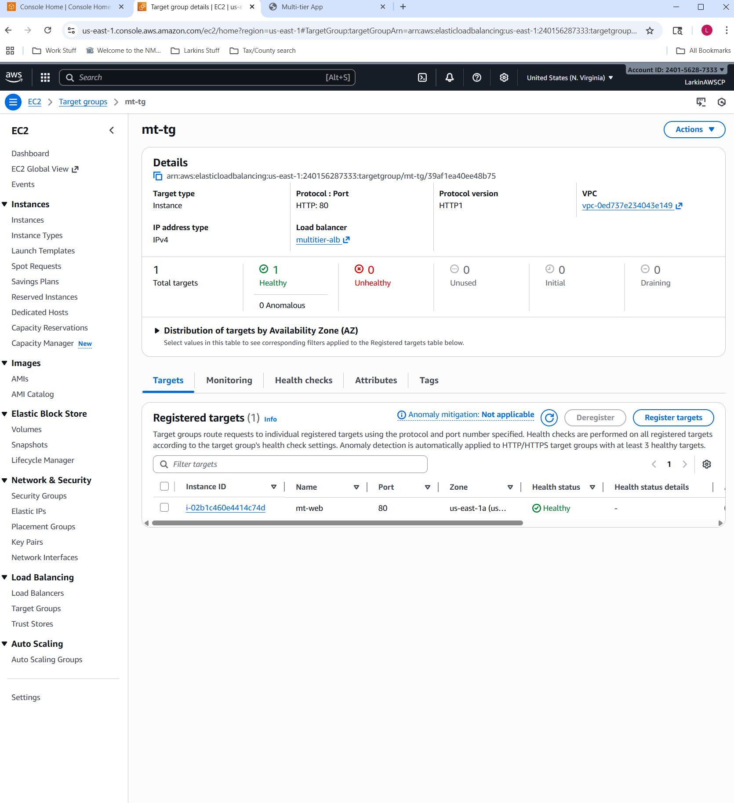
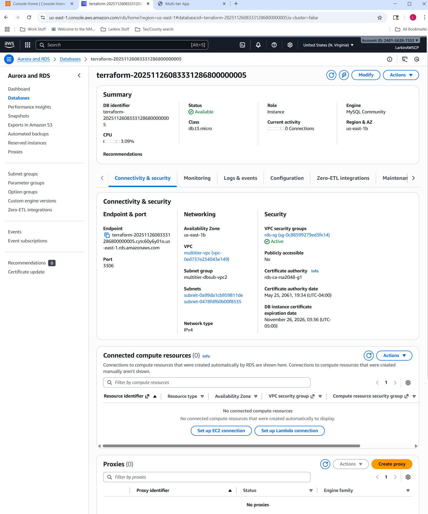
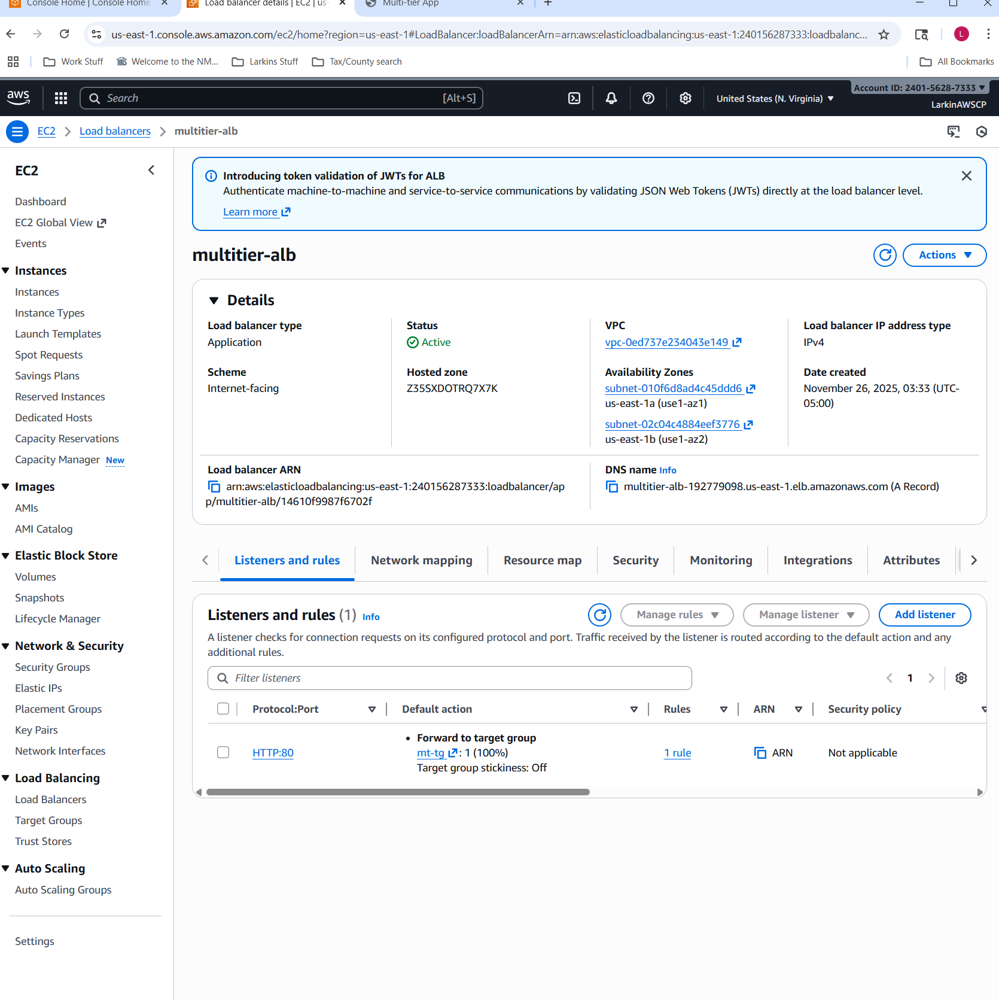
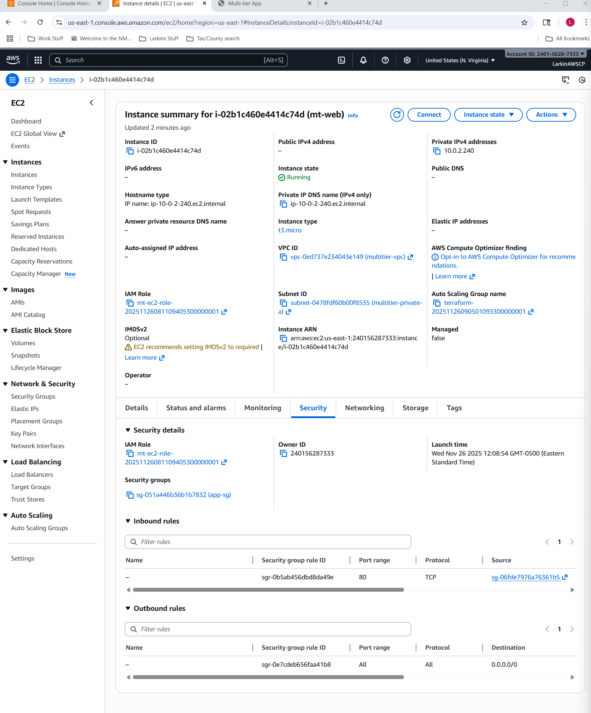
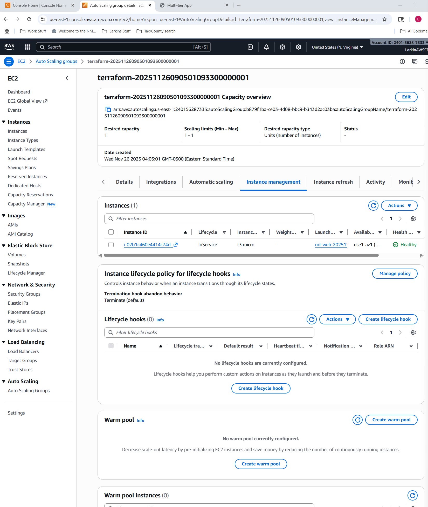
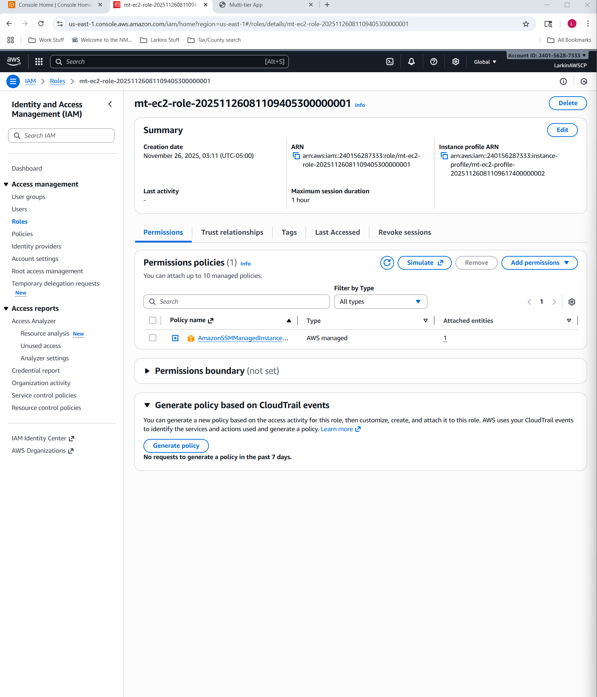
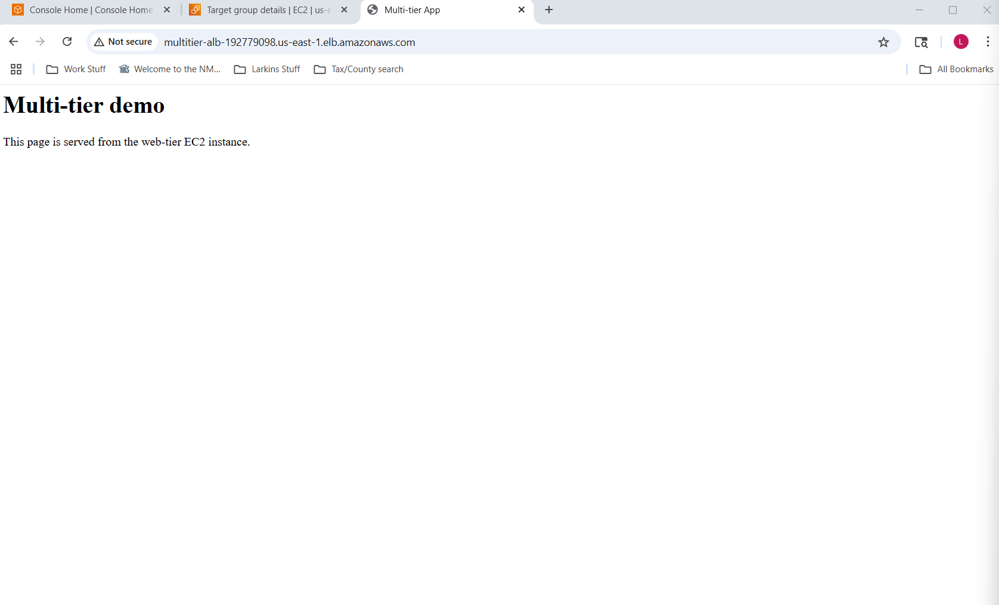

# AWS Multi-Tier Terraform Project

This repo contains the Terraform I used to build a small multi-tier app in AWS.  
Everything here was created from Terraform, not the console.

---

## What this deploys

- **VPC `10.0.0.0/16`** with public and private subnets across two AZs  
- **Internet-facing Application Load Balancer** (`multitier-alb`) in the public subnets  
- **Web tier EC2 instance** (`mt-web`) in a private subnet, managed by an Auto Scaling Group  
- **MySQL RDS instance** (`appdb`) in private subnets (no public access)  
- **IAM role + SSM** so the EC2 instance can be managed through Session Manager instead of SSH  

After `terraform apply`, the ALB DNS endpoint serves the demo page:

> `Multi-tier demo – This page is served from the web-tier EC2 instance.`

This is a lab project for learning AWS + Terraform and practicing repeatable infrastructure.

---

## Architecture

High-level VPC layout:



ALB listener and target group:

  


Web tier + security:

  


Database + IAM:

  


Demo page through the ALB:



---

## Tech stack

- **AWS**: VPC, Subnets, Route Tables, IGW, ALB, EC2, RDS, IAM, SSM  
- **Terraform**: Everything defined locally in HCL (no external modules)  
- **Local environment**: Windows 11 + PowerShell

---

## Repo layout

- `main.tf` – core AWS resources (VPC, subnets, routes, ALB, target group, ASG, EC2, RDS, IAM, SSM)
- `variables.tf` – input variables (region, CIDRs, instance types, etc.)
- `outputs.tf` – key outputs like `alb_dns_name` and `db_endpoint`
- `user_data.sh` – bootstrap script for the web-tier EC2 instance
- `01-...png` – `08-...png` – architecture and AWS console screenshots
- `.gitignore` – ignores `.terraform/`, `terraform.tfstate*`, plan files, and other local junk

---

## Prerequisites

- AWS account with permissions for EC2, RDS, ALB, IAM, and VPC
- Terraform v1.5+ installed locally
- AWS credentials configured (for example in `~/.aws/credentials` or environment variables)

---

## How I run it

From the `terraform` folder:

```bash
# initialize providers and modules
terraform init

# preview what will be created
terraform plan

# deploy the stack
terraform apply